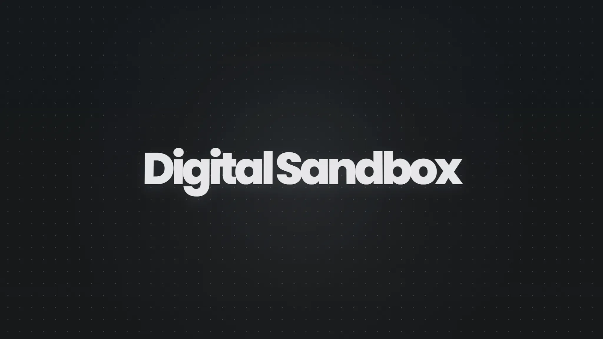

# Digital Sandbox

個人サイトとWebツールの制作プロジェクト。

[Webサイト](https://roseu.net/)

## 機能

- プロフィール・制作物一覧
- Wordleの候補絞り込み・次の推測語の提案
- Minecraftサーバー管理・Discord連携
- PCの状態確認・電源操作

## 使用技術

- フロントエンド: React / React Router / TypeScript / Tailwind CSS / DaisyUI
- バックエンド: Cloudflare Workers / D1
- 認証: Cloudflare Access / Discord OAuth
- PC起動API: AWS Lambda / API Gateway / DynamoDB
